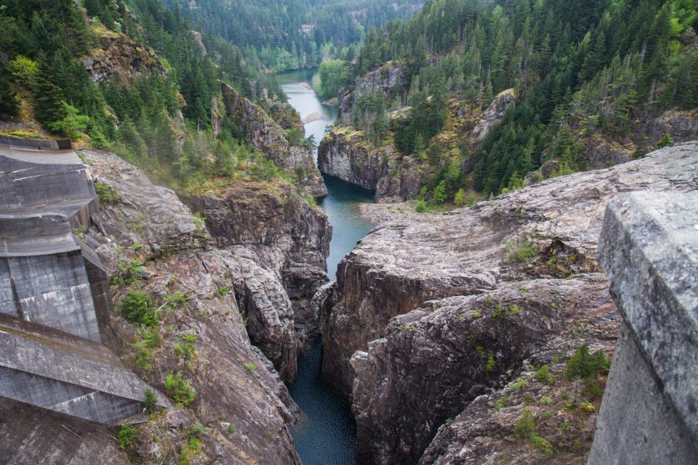

## Project Introduction

Precipitation patterns control characterstics of a stream ecosystem.

* Discharge
* Temperature
* Habitat

Organisms, inclusing anadromous fish rely on the natural flow regime.

* Evolved experiencing natural disturbances
* Time life cycle with seasonal changes/distrubance

## Project Introduction cont.

The Skagit river is only dammed above a natural fish barrier.

* Creates mostly natural flow regime downstream of dams
* Allows for evaluation of effects of precipitation and resulting discharge on steelhead migration timing

```{r, out.width = "400px", echo = FALSE}

```

## Required Packages

```{r, message=FALSE}
library(tidyverse)
```

Specific package use will include

* Dplyr
* GGPlot

## Data 1: Monthly Discharge

```{r, echo=FALSE}
avg_monthly_discharge <- read.csv("../clean_data/avg_monthly_discharge.txt")
avg_monthly_discharge <- avg_monthly_discharge %>% rename("1" = X1, "2" = X2, "3" = X3, "4" = X4, "5" = X5, "6" = X6, "7" = X7, "8" = X8, "9" = X9, "10" = X10, "11" = X11, "12" = X12)
knitr::kable(avg_monthly_discharge[1:5, 1:7])
``` 

Holds the average discharge for each month of the year from 1941 to 2018.

* Each variable header represents the month of the year
* Discharge is in cubic feet per second

## Data 2: Daily Discharge

```{r, echo = FALSE}
avg_daily_discharge <- read.csv("../data/avg_daily_discharge.csv")
knitr::kable(avg_daily_discharge[1:5, 1:4])
```

Each mean value represents the average discharge for that day of the year.

* Discharge given in cubic feet per second
* Mean calculated from data dating 1941 to 2018

## Data 3: Smolt Trap Catch

```{r, echo=FALSE}
yearly_smolt <- read.csv("../data/steelhead_smolt_trapped.csv")
knitr::kable(yearly_smolt[1:5, 1:3])
```

Each smolt value represents the number of smolt caught in a specific type of trap for that year. Trap catches steelhead smolt outmigrants on Skagit river with data from 1990-2007.

## Annual Skagit Hydrograph

```{r, echo=FALSE}
ggplot(avg_daily_discharge)+
  geom_point(mapping = aes(x=day.of.year, y=mean))+
  labs(x="day of year", y= "average discharge (cfs)", title = "Average Annual Hydrograph")
```

Plot graphs average daily discharge values against day of year to show average year of discharge for Skagit river. 

## Annual Skagit Hydrograph cont.

Plot indicates a precipitation pattern dominated by both rain and snow.

* Peak in fall result of high rains

* Peak in winter result of warmer weather melting accumulated snow pack in higher elevations
* Snow melt brings not just high discharge but also cool water temperatures

## Late Spring Discharge

```{r, echo = FALSE}
late_spring_discharge <- subset(avg_monthly_discharge, select = c(6, 7,year)) %>%
  rename(may = "5", june = "6")
late_spring_discharge <- mutate(late_spring_discharge, late_spring = may + june)
knitr::kable(late_spring_discharge[1:5, 1:4])
```

* Modified table to show only average discharge of May and June
* Also includes sum average discharge for two months for later analysis

## Late Spring Discharge vs Smolt Outmigration

```{r}
discharge_and_smolt <- inner_join(late_spring_discharge, 
                                  yearly_smolt, by = "year")
knitr::kable(discharge_and_smolt[1:4,1:6])
```

## Late Spring Discharge vs Smolt Outmigration cont.

* Joined tables of late spring discharge and yearly smolt migration
* Preparation for analysis between discharge and smolt catch

Analysis

* regression test for relationship
* x-axis = late spring discharge
* y-axis = smolt catch (scoop for highest sample size)

## Late Spring Discharge vs Smolt Outmigration Analysis

```{r, echo=FALSE}
ggplot(discharge_and_smolt)+
  geom_point(mapping = aes(x=late_spring, y=smolt..scoop.))+
  labs(x="discharge (cfs)", y="smolt catch #", title = "Discharge vs Smolt Catch")+
  geom_smooth(mapping = aes(x=late_spring, y=smolt..scoop.), method = "lm")
```

## 

```{r,echo=FALSE}
smolt_regression <- lm(smolt..scoop. ~ late_spring, 
                       data = discharge_and_smolt)
summary(smolt_regression)
```

## Potential Climate Chnage Analysis

```{r, echo=false}
ggplot(late_spring_discharge)+
  geom_point(mapping = aes(x=year, y=late_spring))+
  geom_smooth(mapping = aes(x=year, y=late_spring), method="lm")+
  labs(y="late spring discharge (cfs)", title="Late Spring Discharge over Time")
```

##

```{r,echo=FALSE}
late_spring_discharge_regression <- lm(late_spring ~ year, 
                                       data = late_spring_discharge)
summary(late_spring_discharge_regression)
```

